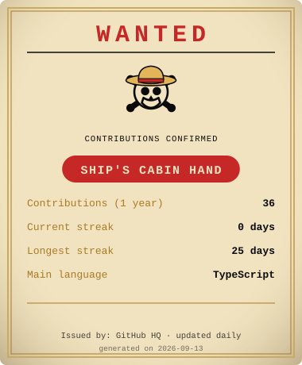

  

  

<table>
<tr>
<td valign="top" width="400">

</td>
<td valign="top">

### 🗺️ Featured projects

**[OnePieceReact](https://github.com/hiagoka/OnePieceReact)**
A React + TypeScript project inspired by the One Piece universe — add characters and build out the anime's crews. Made because One Piece is the work that inspires me the most.

**[ai-chat-mobile](https://github.com/hiagoka/ai-chat-mobile)**
AI-powered mobile chat app, built with React Native and the OpenAI API.

**Web system — Paraíba Military Police**
A web system/application developed for the Military Police of Paraíba (PMPB).

 

### 📡 Contact

</td>
</tr>
</table>

